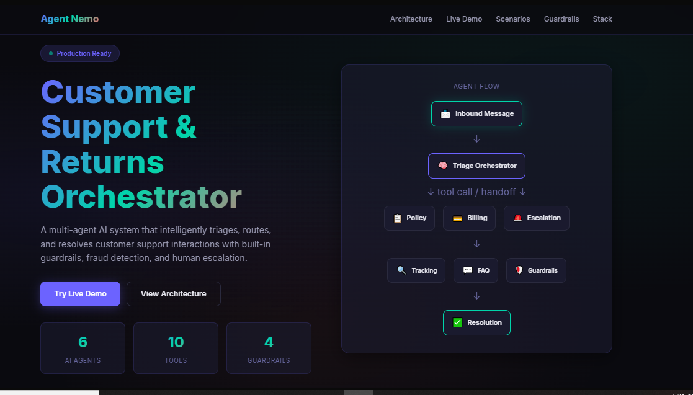
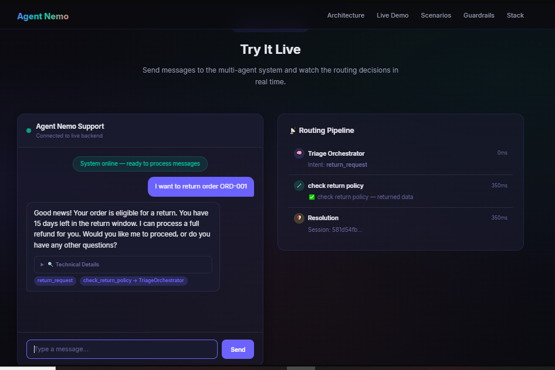
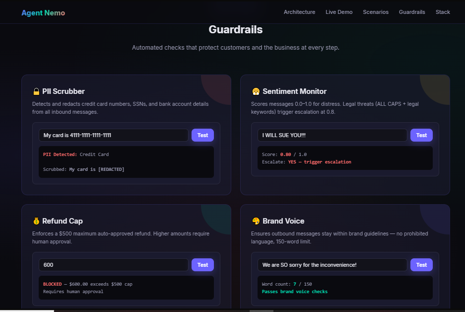
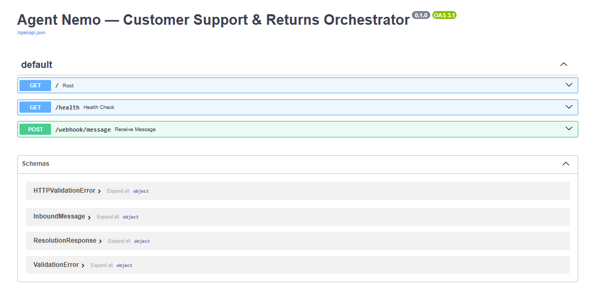
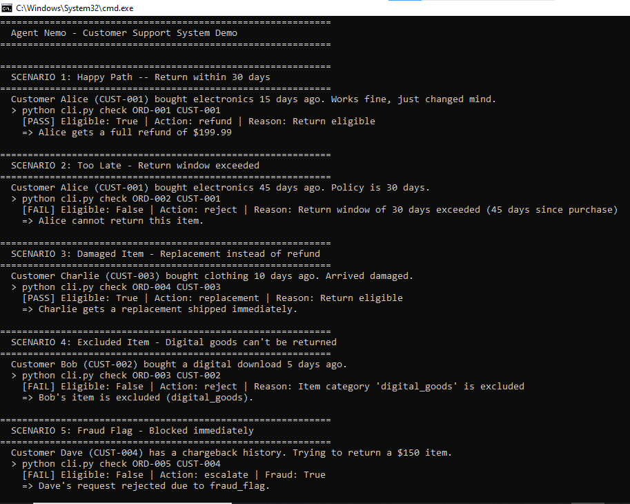
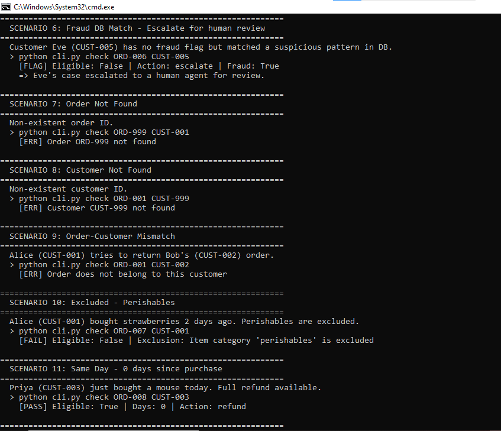
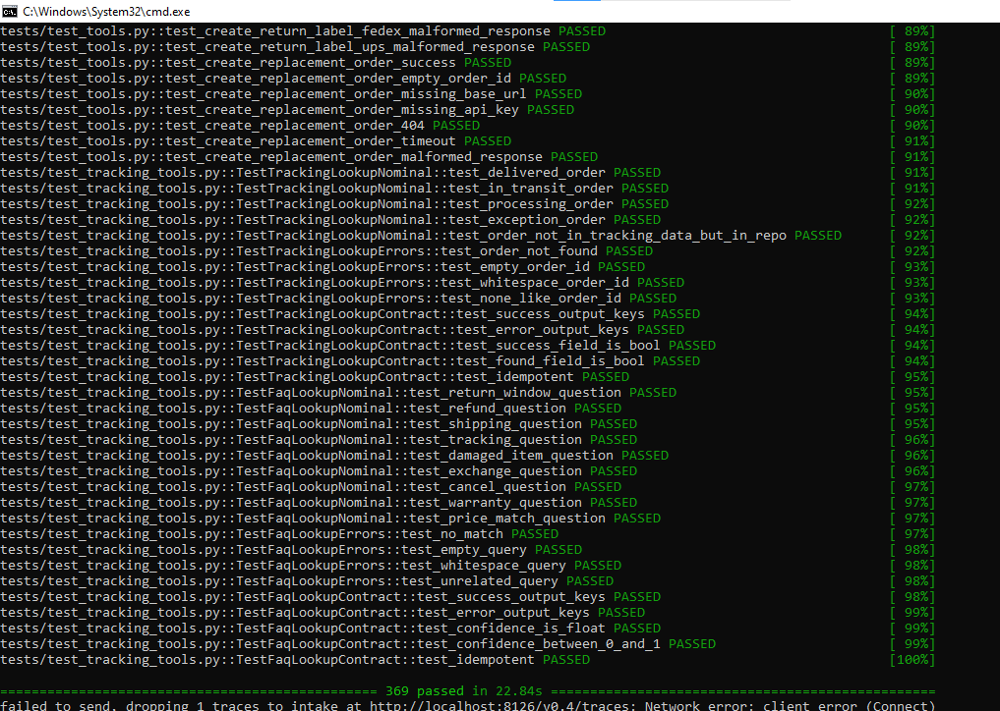
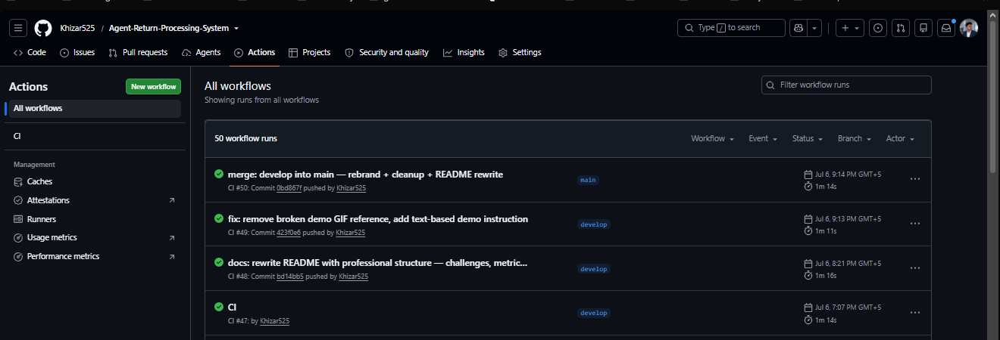

# Agent Nemo

### Multi-Agent Customer Support System

> A production-oriented multi-agent AI system that classifies customer intent, routes to specialist agents, executes tools, and returns natural language responses — with built-in guardrails for PII, sentiment, refunds, and brand voice.

---

<div align="center">


**6 AI Agents** · **10 Function Tools** · **4 Guardrails** · **369 Tests** · **Zero LLM Cost**

</div>

---

## What Is This?

Customer support is repetitive, high-volume, and predictable. Teams handle the same questions daily — *"Where's my order?"*, *"Can I return this?"*, *"I want a refund."* Each requires a human to read, classify, look up data, and respond.

**Agent Nemo automates this pipeline.** It's a multi-agent system that:

1. **Classifies** customer intent from natural language messages
2. **Routes** to the right specialist agent or deterministic tool
3. **Executes** the action (return policy check, tracking lookup, refund processing)
4. **Enforces** safety guardrails (PII redaction, sentiment escalation, refund limits)
5. **Responds** in natural language — not raw JSON

The system handles 5 intent categories across 6 specialized agents, with 10 function tools and 4 guardrails — all running at zero cost using free-tier LLM inference.

---

## Table of Contents

- [Architecture](#architecture)
- [Agents](#agents)
- [Guardrails](#guardrails)
- [Demo Walkthrough](#demo-walkthrough)
- [Screenshots](#screenshots)
- [Engineering Decisions](#engineering-decisions)
- [Testing](#testing)
- [Infrastructure](#infrastructure)
- [Quick Start](#quick-start)
- [Tech Stack](#tech-stack)
- [Team](#team)
- [Roadmap](#roadmap)
- [Documentation](#documentation)
- [License](#license)

---

## Architecture


### Request Lifecycle

Every customer message follows this path:

```
Customer Message
       ↓
PII Scrubber ────────── [REDACT] credit cards, SSNs, bank accounts
       ↓
Sentiment Monitor ───── Score 0.0–1.0 → escalate if ≥ 0.8
       ↓
Triage Orchestrator ─── Keyword-first intent classification
       ↓
┌──────────────────────────────────────────────┐
│  Intent              │  Action               │
│──────────────────────│───────────────────────│
│  return_request      │  check_return_policy  │
│  order_status        │  tracking_lookup      │
│  general_inquiry     │  faq_lookup           │
│  billing_dispute     │  → BillingAgent       │
│  edge_case_escalate  │  → EscalationAgent    │
└──────────────────────────────────────────────┘
       ↓
Natural Language Response
```

### Orchestration Strategy

Agent Nemo uses a **Manager + Handoff hybrid** pattern (see [ADR-001](docs/ADR-001.md)):

- **Tool calls** (tracking, FAQ, return eligibility) — dispatched deterministically by code. The orchestrator retains context.
- **Handoffs** (Policy, Billing, Escalation) — give full specialist ownership. The specialist manages its own tool calls.

This hybrid approach was chosen because:
- Pure handoff patterns lose orchestrator context between steps
- Pure manager patterns can't handle multi-step specialist workflows
- Deterministic dispatch avoids LLM-dependent tool call failures

### Deterministic Routing

The Triage Orchestrator classifies intent using **keyword-first rules**, not LLM-dependent classification:

```python
_KEYWORD_RULES = {
    "return_request": ["return", "refund", "exchange", "damaged"],
    "order_status": ["tracking", "where is", "shipped", "delivery"],
    "billing_dispute": ["charge", "billed", "payment", "invoice"],
    "general_inquiry": ["help", "question", "how", "policy"],
    "edge_case_escalate": ["lawyer", "sue", "legal", "manager"],
}
```

This avoids the SDK limitation where `Runner.run()` consumes tool call results internally and never exposes them to the caller. Keyword routing is deterministic — the LLM never produces malformed JSON that breaks the primary pipeline.


---

## Agents

Each agent owns a single bounded context. The orchestrator either calls tools directly or hands off to a specialist.

| Agent | Responsibility | When Invoked | Tools | Handoff To |
|-------|---------------|--------------|-------|------------|
| **Triage Orchestrator** | Classify intent, route messages | Every inbound message | None (classifier only) | Policy, Billing, Escalation |
| **PolicyAgent** | Evaluate return eligibility | `return_request` intent | `check_return_policy`, `get_customer_profile` | ResolutionAgent |
| **ResolutionAgent** | Process refunds, labels, replacements | After PolicyAgent approval | `process_refund`, `create_return_label`, `create_replacement_order` | CommunicationAgent |
| **BillingAgent** | Handle billing disputes | `billing_dispute` intent | `process_refund` | CommunicationAgent |
| **CommunicationAgent** | Draft notifications | After any resolution | `send_notification` | — |
| **EscalationAgent** | Human handoff with context | `edge_case_escalate` intent | `create_human_ticket`, `log_resolution` | — |


---

## Guardrails

Guardrails are not afterthoughts — they're first-class system components that enforce safety constraints at input and output boundaries.


### Input Guardrails

| Guardrail | Business Risk | Trigger | Example | Outcome |
|-----------|--------------|---------|---------|---------|
| **PII Scrubber** | Credit card numbers or SSNs in chat logs create liability | Credit card pattern, SSN pattern, bank account pattern | `My card is 4111-1111-1111-1111` | `My card is [REDACTED]` |
| **Sentiment Monitor** | Frustrated customers escalate publicly if not handled early | Score ≥ 0.8 (ALL CAPS +0.3, legal keywords +0.4, distress +0.2, profanity +0.2) | `I WILL SUE YOU THIS IS OUTRAGEOUS` | Score: 0.9 → Force `edge_case_escalate` |

### Output Guardrails

| Guardrail | Business Risk | Trigger | Example | Outcome |
|-----------|--------------|---------|---------|---------|
| **Refund Cap** | Automated refunds exceeding threshold create financial exposure | Refund amount > $500 | Agent tries to refund $600 | Blocked — requires human approval |
| **Brand Voice** | Inconsistent tone damages customer trust | Prohibited words, excessive length (>150 words) | "Unfortunately, as per our policy..." | Rewritten with friendly alternatives |

### Sentiment Scoring Weights

| Signal | Weight | Example |
|--------|--------|---------|
| ALL CAPS (>10 chars) | +0.3 | "I WILL SUE YOU" |
| Legal keywords | +0.4 | sue, lawyer, attorney, court, legal, litigation |
| Distress keywords | +0.2 | crying, desperate, ruined, outrageous, unacceptable, furious |
| Profanity | +0.2 | profane language (weighted +0.2) |
| Multiple exclamations | +0.1–0.2 | "!!!" → +0.1, "!!??" → +0.2 |

**Threshold:** ≥ 0.8 triggers escalation. Float precision handled via `round(score, 10)`.

---

## Demo Walkthrough

Five real scenarios demonstrating the system's routing, guardrails, and tool execution.

### Scenario 1: Return Request — Happy Path

```
Input:      "I want to return my headphones, order ORD-001"
Routing:    intent = return_request → check_return_policy
Guardrail:  PII clean, Sentiment 0.0
Tool:       check_return_policy(CUST-001, ORD-001)
Output:     "Good news! Your order is eligible for a return.
            You have 15 days left in the return window."
```

### Scenario 2: PII Detection

```
Input:      "My credit card is 4111-1111-1111-1111, I need a refund"
Routing:    intent = general_inquiry → faq_lookup
Guardrail:  PII SCRUBBED → credit card replaced with [REDACTED]
Tool:       faq_lookup("refund")
Output:     "Refunds are processed within 5-7 business days..."
```

### Scenario 3: Sentiment Escalation

```
Input:      "I WILL SUE YOU THIS IS OUTRAGEOUS AND UNACCEPTABLE"
Routing:    intent = edge_case_escalate (sentiment override)
Guardrail:  Sentiment score 0.9 ≥ 0.8 → FORCE escalation
            Signals: ALL CAPS (+0.3), legal keywords (+0.4), distress (+0.2)
Tool:       create_human_ticket (escalation)
Output:     "I take your concerns very seriously. I'm immediately
            escalating this to a senior specialist..."
```

### Scenario 4: Refund Cap

```
Input:      "I want a $700 refund for order ORD-002"
Routing:    intent = return_request → check_return_policy
Guardrail:  Refund Cap blocks refunds > $500
Tool:       check_return_policy → eligible, but refund blocked
Output:     "I understand you'd like a refund. However, refunds over
            $500 require human approval. I'm escalating your request
            to a specialist who can assist further."
```

### Scenario 5: Tracking Lookup — Deterministic Routing

```
Input:      "Where is my order ORD-003?"
Routing:    intent = order_status → tracking_lookup
Guardrail:  PII clean, Sentiment 0.0
Tool:       tracking_lookup(ORD-003)
Output:     "It's on its way! Carrier: FedEx (Tracking: FX-5647382910).
            Estimated delivery: June 30."
```

---

## Screenshots



*Landing page with agent flow visualization and system statistics.*



*Live chat with real-time routing pipeline — intent classification, tool execution, and response timing.*



*Interactive guardrail testing — PII Scrubber, Sentiment Monitor, Refund Cap, Brand Voice.*



*FastAPI Swagger documentation with endpoints and Pydantic schemas.*



*Policy tool scenarios: happy path, window exceeded, damaged item, excluded goods, fraud flag.*



*Policy tool scenarios: fraud DB match, not found, mismatch, perishables, same-day boundary.*



*369 tests passing across 9 test files — 0 skipped, 0 failed.*



*CI pipeline with consistent green checkmarks across main and develop branches.*


*Illustrative monitoring dashboard demonstrating observability capabilities. Values shown are example data — real metrics require deployed infrastructure (Redis, Kafka, Datadog).*

---

## Engineering Decisions

### 1. Deterministic Routing Over LLM-Only Classification

**Problem:** LLMs occasionally produce malformed JSON, misclassify intents, or hallucinate tool names. In a support system, routing failures mean failed customer interactions.

**Solution:** Keyword-first classification with optional LLM enrichment. The orchestrator uses regex-based keyword rules for primary routing. The LLM provides enrichment for ambiguous cases but never controls the dispatch path.

**Result:** Deterministic routing — the LLM never breaks the pipeline.

### 2. Tool-First Execution Over Agent-Only Workflows

**Problem:** The OpenAI Agents SDK's `Runner.run()` consumes tool call results internally and never exposes them to the caller. This makes it impossible to inspect, log, or react to tool results.

**Solution:** Move tool execution to the code layer. Tools are called directly by the orchestrator, not by the LLM. The LLM only provides classification and reasoning — the code executes the actions.

**Result:** Full visibility into tool results, deterministic behavior, and zero LLM-dependent failures.

### 3. Layered Guardrails Over Post-Hoc Validation

**Problem:** Guardrails applied after response generation can't prevent harmful outputs. PII in chat logs, excessive refunds, and brand violations must be caught before they reach the customer or database.

**Solution:** Input guardrails (PII, Sentiment) run before the orchestrator sees the message. Output guardrails (Refund Cap, Brand Voice) run before responses are sent. Guardrails are first-class components, not decorators.

**Result:** PII never enters the system. Sentiment overrides happen before routing. Refunds are blocked before processing.

### 4. Graceful Degradation Over Hard Dependencies

**Problem:** Requiring Redis, Kafka, or Datadog to be running makes local development impossible and creates single points of failure.

**Solution:** Every infrastructure component has a fallback. Redis → in-memory dict. Kafka → direct HTTP. Datadog → no-op spans. The system works without any external services.

**Result:** Zero-config local development. Production deployment adds observability without changing behavior.

### 5. Human-in-the-Loop Escalation Over Full Automation

**Problem:** Some cases require human judgment — legal threats, fraud signals, high-value refunds. Full automation creates legal and financial risk.

**Solution:** The EscalationAgent bundles full context (customer profile, conversation history, guardrail triggers, tool results) into a human-readable ticket. The Refund Cap guardrail blocks refunds > $500 and requires human approval.

**Result:** Complex cases get human attention with full context. Routine cases are automated.

### 6. Repository Architecture

```
app_agents/     → Agent definitions (orchestrator, policy, resolution, billing, comm, escalation)
tools/          → Tool implementations (CRM, payment, shipping, tracking, notification, helpdesk)
guardrails/     → Safety components (PII, sentiment, refund cap, brand voice)
database/       → Data layer (SQLAlchemy 2.0 ORM, 3 backends)
infra/          → Infrastructure (Redis, Kafka, Datadog, K8s, CSAT, A/B testing)
tests/          → 369 tests across 9 files with fixture-driven data
```

Each directory has a single responsibility. No circular dependencies. No god objects.

---

## Testing

### Strategy

The test suite validates three layers:

1. **Unit tests** — Individual tool functions, guardrail logic, DTOs
2. **Integration tests** — Agent workflows, session management, pipeline skeletons
3. **Schema tests** — Tool interface compliance, error handling, output contracts

### Test Breakdown

| File | Owner | Tests | Coverage |
|------|-------|-------|----------|
| `test_policy_agent.py` | Mustafa | 106 | Policy tool, guardrails, agent config, contracts, PII, sentiment, refund cap |
| `test_tools.py` | Hammad | 44 | CRM, payment, shipping tools with respx mocks |
| `test_integration.py` | Khizar | 40 | Fixture integrity, policy tool, tracking, FAQ, session, intent mapping |
| `test_infra_observability.py` | Anas | 41 | Kafka, Datadog, monitors, CSAT pipeline, A/B testing |
| `test_database.py` | Khizar | 37 | DTOs, MemoryBackend, FileBackend, repository factory |
| `test_tracking_tools.py` | Khizar | 32 | Tracking lookup, FAQ lookup, contracts, edge cases |
| `test_resolution_agent.py` | Hammad | 21 | Resolution agent, tool invocation, E2E with mocks |
| `test_billing_agent.py` | Khizar | 18 | Billing agent, schema, refund cap enforcement |
| `test_comm_escalation.py` | Ammar | 14 | Notifications, brand voice, escalation, helpdesk |

**Total: 369 tests — 0 skipped, 0 failed**

### CI Validation

Every push and PR triggers the GitHub Actions pipeline:

```
Ruff Lint → MyPy Type Check → Pytest (Python 3.11, 3.12, 3.13, 3.14)
```

The pipeline enforces:
- Zero lint violations (Ruff, line-length=100)
- Zero type errors (MyPy strict mode)
- 369/369 tests passing


---

## Infrastructure

Agent Nemo's infrastructure modules are **fully implemented** with production-quality code, graceful degradation, and comprehensive test coverage. They are **dormant** — meaning they require external services to be running.

| Component | Implementation | Provisioning | Status |
|-----------|---------------|--------------|--------|
| **Redis** | Async client, session get/save/archive with TTL, graceful fallback | Requires running Redis server | ✅ Implemented · ⏳ Dormant |
| **Kafka** | 4-channel consumer, message validation, HTTP forwarding, CLI entry point | Requires running Kafka cluster | ✅ Implemented · ⏳ Dormant |
| **Datadog APM** | `ddtrace.patch_all()`, span creation, metric emission, graceful degradation | Requires Datadog agent + API key | ✅ Implemented · ⏳ Dormant |
| **Datadog Monitors** | 3 PagerDuty-bound monitors (queue depth, error rate, P95 latency) | Requires Datadog provisioning | ✅ Implemented · ⏳ Dormant |
| **CSAT Pipeline** | Rolling average (deque maxlen=1000), per-agent tracking, Datadog + Redis sync | Requires Datadog + Redis | ✅ Implemented · ⏳ Dormant |
| **A/B Testing** | SHA-256 hash partitioning, deterministic variant assignment, result recording | Requires Datadog | ✅ Implemented · ⏳ Dormant |
| **Kubernetes** | 5 deployments, 5 services, 5 HPAs, configmap — production-quality manifests | Requires K8s cluster | ✅ Implemented · ⏳ Dormant |

**Key distinction:** These are not placeholders or skeletons. Every module contains real I/O operations, proper error handling, environment variable configuration, and 41 dedicated tests. They are production-ready code that becomes operational when external services are provisioned.

---

## Quick Start

### Prerequisites

- Python 3.11+
- pip

### 1. Clone & Configure

```bash
git clone https://github.com/Khizar525/Agent-Return-Processing-System.git
cd Agent-Return-Processing-System
python -m venv venv
source venv/bin/activate        # Windows: venv\Scripts\activate
pip install -r requirements.txt
cp .env.example .env
# Edit .env and add your OpenRouter API key:
# OPENROUTER_API_KEY=your_key_here
```

### 2. Start Services

```bash
# Backend (Terminal 1)
uvicorn main:app --reload --host 0.0.0.0 --port 8000

# Frontend (Terminal 2)
cd frontend && python -m http.server 3000
```

### 3. Access

| Service | URL |
|---------|-----|
| Frontend | http://localhost:3000 |
| Backend API | http://localhost:8000 |
| API Docs | http://localhost:8000/docs |
| Health Check | http://localhost:8000/health |

### 4. Run Tests

```bash
pytest tests/ -v                    # all 369 tests
pytest tests/ --cov -v              # with coverage
ruff check .                        # lint
ruff format --check .               # format check
mypy .                              # type check
```

---

## Tech Stack

| Layer | Technology | Purpose |
|-------|-----------|---------|
| **Agent Framework** | OpenAI Agents SDK | Agent definitions, tool decorators, guardrail wrappers |
| **LLM** | OpenRouter — `openai/gpt-oss-120b:free` | Free-tier inference (30 requests/min, 1,000 requests/day) |
| **Backend** | FastAPI + Uvicorn | Async API server with Pydantic validation |
| **Frontend** | Single-file HTML/CSS/JS | Glassmorphism UI, zero dependencies |
| **Database** | SQLAlchemy 2.0 | ORM with PostgreSQL (prod), SQLite (dev), Memory (test) |
| **Guardrails** | Custom input/output | PII, Sentiment, Refund Cap, Brand Voice |
| **HTTP Client** | httpx | Async external API calls (CRM tool) |
| **Linting** | Ruff | Fast Python linter (line-length=100) |
| **Type Checking** | MyPy | Strict mode, Python 3.11+ |
| **Testing** | pytest | 369 tests with respx mocks and fixture data |
| **CI/CD** | GitHub Actions | Lint → Type Check → Test (4 Python versions) |

---

## Team

Developed during the SMIT Agentic AI Program by a team of five engineers.

| Member | Ownership | Key Contributions |
|--------|-----------|-------------------|
| **Khizar** | Lead Engineer & Architect | Triage Orchestrator, deterministic routing, session management, CI/CD pipeline, architecture (ADR-001), integration tests, repository cleanup |
| **Mustafa** | Policy & Guardrails | Policy Agent, PII Scrubber, Sentiment Monitor, Refund Cap, database abstraction (3 backends), 106 policy tests |
| **Hammad** | Resolution & Tools | Resolution Agent, CRM/Payment/Shipping tools, 44 tool tests with respx mocks, E2E agent workflows |
| **Ammar** | Communication & Escalation | Communication Agent, Escalation Agent, Brand Voice guardrail, notification/helpdesk tools |
| **Anas** | Infrastructure & Observability | Redis, Kafka, Datadog APM, K8s manifests, CSAT pipeline, A/B testing framework, 41 infra tests |

---

## Roadmap

### Short-term
- [ ] Dockerfile + docker-compose.yml for containerized deployment
- [ ] API authentication (API keys / JWT)
- [ ] WebSocket support for real-time chat updates
- [ ] Alembic database migrations

### Medium-term
- [ ] React/Next.js frontend with component architecture
- [ ] Structured logging (structlog) with correlation IDs
- [ ] Rate limiting (slowapi) for API protection
- [ ] Helm charts for Kubernetes deployment

### Long-term
- [ ] Multi-tenant support for multiple e-commerce stores
- [ ] Custom agent development SDK
- [ ] Deploy to cloud with SLA dashboards (response time < 2s, availability > 99.5%)
- [ ] Multi-language support for international customers

---

## Documentation

| Document | Description |
|----------|-------------|
| [ADR-001](docs/ADR-001.md) | Architecture Decision — Manager + Handoff hybrid pattern |
| [Tool Interface Spec](docs/tool_interface_spec.md) | Authoritative tool signatures, contracts, and error handling |
| [Tracing Dashboard](docs/tracing_dashboard.md) | Datadog APM dashboard configuration |
| [CONTRIBUTING.md](CONTRIBUTING.md) | Branch rules, commit format, PR checklist |
| [AGENTS.md](AGENTS.md) | Full architecture, agents, tools, guardrails, tests |

---

## License

MIT License — see [LICENSE](LICENSE)

---

<div align="center">

**Built by Khizar, Mustafa, Hammad, Ammar, and Anas**

*Built with production engineering practices in mind*

</div>
